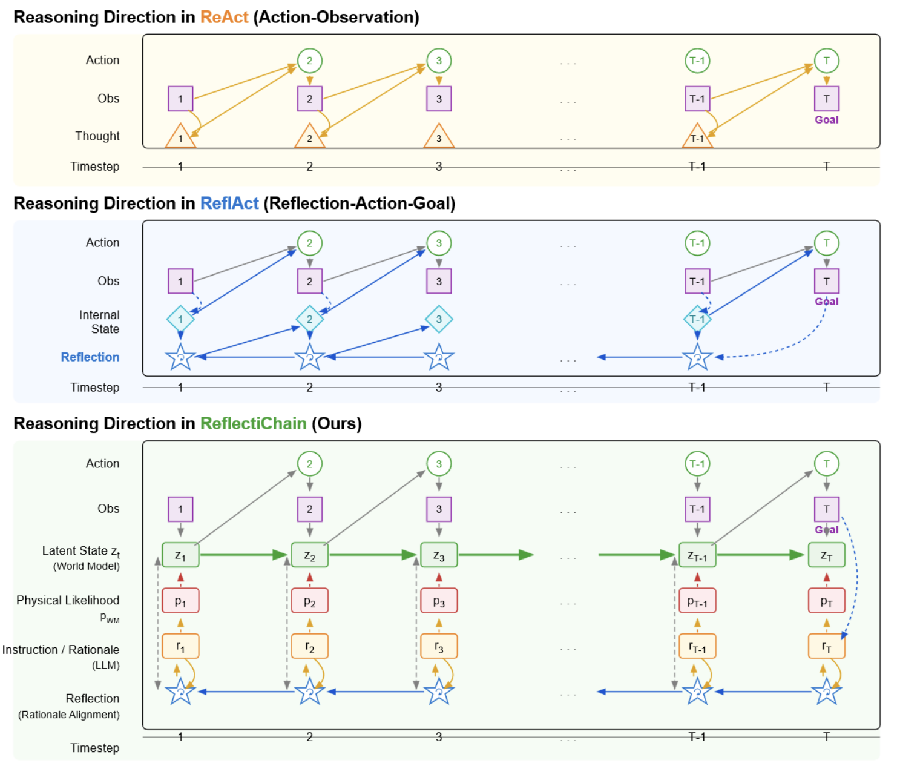

<div align="center">

# 🧠🔗 ReflectiChain

### 🧭 Grounding Long-Horizon LLM Planning against Semantic–Execution Drift

**Jia Luo**

<br>

[](https://ieeexplore.ieee.org/document/11663390)
[](https://doi.org/10.1109/LSP.2026.3726840)
[](https://ieeexplore.ieee.org/document/11663390)

<br><br>

📄 **[Paper](https://ieeexplore.ieee.org/document/11663390)**
&nbsp;&nbsp;•&nbsp;&nbsp;
🔗 **[DOI](https://doi.org/10.1109/LSP.2026.3726840)**
&nbsp;&nbsp;•&nbsp;&nbsp;
📚 **[Citation](#citation)**

</div>

---

### ✨ What is ReflectiChain?

**ReflectiChain** addresses **semantic–execution drift** in long-horizon LLM agents by combining **latent physical anticipation** with **retrospective semantic reflection**, helping agents preserve the original instruction throughout extended interactions.


<p align="center">
  
</p>

<p align="center"><em>Reasoning directions in ReAct, ReflAct, and ReflectiChain.</em></p>

## 🗺️ Contents

- 💡 [Motivation](#motivation)
- 🧠 [Core Idea](#core-idea)
- 🏗️ [Framework](#framework)
- 🧭 [Semantic–Execution Drift](#semanticexecution-drift)
- 📊 [Experimental Evaluation](#experimental-evaluation)
- 📄 [Publication](#publication)
- 📚 [Citation](#citation)
- 📦 [Repository Scope](#repository-scope)

## 💡 Motivation

Long-horizon agents must adapt to changing environments while continuing to respect the **original instruction**. In practice, locally successful actions can gradually alter the agent's effective interpretation of that instruction. Over extended interactions, these semantic reinterpretations may accumulate and eventually produce a **constraint violation**.

We refer to this failure mode as **semantic–execution drift**.

### 🎯 Central Question

> **How can an LLM agent continuously preserve the semantic boundaries of the original instruction while adapting its actions to a changing physical environment?**

## 🧠 Core Idea

ReflectiChain treats constrained long-horizon planning as a **trajectory-level reasoning problem**, rather than a sequence of isolated action decisions.

### 🔮 1. Latent Physical Anticipation

Before committing to an action, the agent anticipates possible future physical states through a **latent rollout**. This encourages reasoning about both the immediate action and its downstream consequences.

### 🔄 2. Retrospective Semantic Reflection

After interacting with the environment, the agent retrospectively evaluates the resulting trajectory against the **original instruction**. The current reasoning is repeatedly re-anchored to the initial semantic constraints.

### 🧩 Trajectory-Level Semantic Memory

Together, these components form a **trajectory-level semantic memory** that conditions subsequent planning:

> 🔮 **Anticipate** → ⚙️ **Execute** → 🔄 **Reflect** → 🧠 **Re-anchor** → 🧭 **Plan**

这部分公式比较多，所以我不建议狂塞 emoji；最好是**大标题有 icon + 小标题按模块加 icon**，公式区域保持学术感。可以直接改成：

```markdown
## 🏗️ Framework

ReflectiChain integrates a lightweight **latent world model** with **semantic reflection** to form a closed-loop reasoning framework for long-horizon planning.

### 🌐 Latent World Model

The paper's world model uses a fixed, analytic transition over a six-dimensional latent state:

```text
z_t = (inventory, congestion, demand, carbon, stockout, tension)
z_{t+1} = z_t + Δt · f_ω(z_t, a_t)
```

The transition coefficients are initialized from environment statistics and held fixed; the model advances only the latent state online. The framework therefore uses a **lightweight physical prior** rather than a separately trained neural simulator.

### ⚖️ Physically Grounded Action Selection

Candidate actions combine the language-model prior with physical feasibility:

\[
a_t^* = \arg\max_{a_t}\left[
\log p_{LLM}(a_t\mid C_{rule})
+
\lambda\log p_{WM}(\hat r\mid z_t,a_t)
\right].
\]

This allows the agent to balance **semantic plausibility** with anticipated **physical consequences**.

### 🔄 Semantic Reflection & Policy Calibration

The reflection signal also supplies a semantic advantage for test-time policy calibration:

\[
\nabla_\theta J(\theta)
\approx
\mathbb{E}\left[
A_{sem}(s,a)\nabla_\theta\log\pi_\theta(a\mid s)
\right].
\]

At a high level, the reasoning loop is:

```text
📝 Original Instruction
          ↓
🌐 Current State → 🔮 Latent Rollout → ⚡ Action → 🌍 Environment
        ↑                                      ↓
        └──── 🧭 Semantic Re-anchoring ← 🔄 Reflection ← 👁️ Observation
```

### 🧠 Trajectory-Level Semantic Memory

Let \(\mathcal{I}\) denote the original instruction, \(s_t\) the current environmental state, \(a_t\) the selected action, and \(\mathcal{M}_t\) the trajectory-level semantic memory.

ReflectiChain updates the memory by reflecting on the instruction and the observed transition:

\[
\mathcal{M}_{t+1}
=
\operatorname{Reflect}
(\mathcal{I}, \mathcal{M}_t, s_t, a_t, s_{t+1}).
\]

The next action is then selected using both the new state and the reconstructed semantic memory:

\[
a_{t+1}
=
\pi(s_{t+1}, \mathcal{M}_{t+1}).
\]

### 🔁 Closed-Loop Reasoning

> 🔮 **Predict** → ⚡ **Execute** → 👁️ **Observe** → 🔄 **Reflect** → 🧭 **Re-anchor** → ♻️ **Continue**

## Semantic–execution drift

We use semantic–execution drift to describe the divergence between the intended semantic constraint and the semantics implied by the executed trajectory. If \(\hat{\mathcal{I}}_t\) denotes the instruction semantics implicitly reconstructed at timestep \(t\), the drift can be written abstractly as:

\[
D_t = d(\mathcal{I}, \hat{\mathcal{I}}_t).
\]

Without explicit re-anchoring, local decisions may progressively change the effective interpretation of the task. ReflectiChain is designed to suppress this accumulation through repeated trajectory-level reflection.

## Experimental evaluation

ReflectiChain is evaluated on the **Sema-Sim benchmark** (*Semantic-Interactive Multi-Agent Supply Chain Simulation*). Sema-Sim models a four-tier supply chain (Supplier, Manufacturer, Distributor, Retailer) with 10 heterogeneous nodes and approximately 30 transportation edges. It injects natural-language hard constraints and non-stationary policy shocks to create conflicts between semantic fidelity and local task success.

The paper evaluates 3,000 heuristic trajectories and reports four complementary metrics:

- **TS**: Task Success, the strict binary goal indicator.
- **CCR**: Constraint Compliance Rate, the fraction of steps satisfying all hard constraints.
- **TI**: Trajectory Instability, where lower values indicate less rationale oscillation and drift.
- **RCS**: Rationale Consistency Score, the semantic alignment between step-wise rationales and the initial constraints.

The evaluation considers both task execution and semantic consistency. ReflectiChain achieves the highest RCS for every reported backbone, with relative gains of **33.0%, 30.6%, 33.4%, and 30.6% over ReflAct** on Qwen2.5-7B, InternLM2.5-7B-Chat, Llama-3.1-8B-Instruct, and GPT-4o-mini, respectively.

### Main results

Values are transcribed from Table II of the author-version manuscript. TS is reported as the paper's task-success score; CCR and RCS are percentages; lower TI is better.

| Model | Prompting strategy | TS ↑ | CCR (%) ↑ | TI ↓ | RCS (%) ↑ |
| :--- | :--- | ---: | ---: | ---: | ---: |
| RL Agent | PPO | -0.20 | 60.72 | 1.34 | — |
| Qwen2.5-7B | NoThinking (Direct-CoT) | 2.11 | 68.30 | 6.12 | 48.20 |
| Qwen2.5-7B | ReAct | 7.48 | 78.99 | 5.79 | 52.34 |
| Qwen2.5-7B | ReflAct | 8.12 | 80.45 | 5.10 | 66.50 |
| **Qwen2.5-7B** | **ReflectiChain (Ours)** | **1.85** | **84.28** | **3.90** | **88.45 (+33.0% vs ReflAct)** |
| InternLM2.5-7B-Chat | NoThinking (Direct-CoT) | 2.30 | 70.15 | 6.05 | 50.12 |
| InternLM2.5-7B-Chat | ReAct | 7.61 | 78.99 | 5.30 | 54.10 |
| InternLM2.5-7B-Chat | ReflAct | 8.40 | 81.10 | 4.88 | 68.20 |
| **InternLM2.5-7B-Chat** | **ReflectiChain (Ours)** | **2.05** | **85.10** | **3.85** | **89.10 (+30.6% vs ReflAct)** |
| Llama-3.1-8B-Instruct | NoThinking (Direct-CoT) | 2.02 | 67.55 | 6.20 | 47.15 |
| Llama-3.1-8B-Instruct | ReAct | 7.25 | 77.40 | 5.85 | 51.20 |
| Llama-3.1-8B-Instruct | ReflAct | 7.95 | 79.20 | 5.15 | 64.80 |
| **Llama-3.1-8B-Instruct** | **ReflectiChain (Ours)** | **1.70** | **83.15** | **3.95** | **86.45 (+33.4% vs ReflAct)** |
| GPT-4o-mini | NoThinking (Direct-CoT) | 3.10 | 72.80 | 5.45 | 53.40 |
| GPT-4o-mini | ReAct | 8.85 | 82.15 | 4.90 | 58.65 |
| GPT-4o-mini | ReflAct | 9.42 | 84.60 | 4.12 | 71.30 |
| **GPT-4o-mini** | **ReflectiChain (Ours)** | **2.45** | **89.40** | **3.10** | **93.12 (+30.6% vs ReflAct)** |

### Hard-constraint categories

| Category | Example constraint | Drift pressure |
| :--- | :--- | :--- |
| Temporal logic | Do not access target C before approval | Delay recovery |
| Data sovereignty | Keep restricted data within certified nodes | Route disruption |
| Certification | Use only certified transportation edges | Capacity bottleneck |
| Safety priority | Never bypass blocked safety gates | Local success conflict |
| Resource budget | Keep emergency actions below budget | Throughput loss |

### Ablation results

| Variant | CEE ↑ | RC (%) ↑ | RCS (%) ↑ | Failure mode |
| :--- | ---: | ---: | ---: | :--- |
| **ReflectiChain** | **2.55** | **82.50** | **88.45** | — |
| w/o WM | 2.39 | 75.10 | 76.30 | Lack of physical priors |
| w/o Retro | 2.19 | 71.45 | 58.12 | — |

The paper also reports that **ReAct + Rule Verbalization** reaches only **58.2% RCS**, while removing the world model reduces CCR to **75.10%** and removing retrospective reflection reduces RCS to **58.12%**.

## Key takeaways

- **Semantic consistency is temporal.** Instruction following must remain grounded throughout the complete interaction trajectory.
- **Physical reasoning matters.** Language-level reasoning alone may be insufficient when actions interact with an evolving environment.
- **Reflection reconstructs semantics.** Reflection is used to reconnect the current trajectory with the original instruction, not only to correct the last error.
- **Reliable agents need closed-loop reasoning.** The workflow moves from static prompt-to-action reasoning toward semantic constraint, physical prediction, action, reflection, and semantic reconstruction.
- **Physical grounding and retrospective reflection are both necessary.** The ablations show that removing either component materially reduces compliance or rationale consistency.

## Publication

**ReflectiChain: Grounding Long-Horizon LLM Planning against Semantic–Execution Drift**

Jia Luo · *IEEE Signal Processing Letters* · 2026 · Early Access

- [IEEE Xplore](https://ieeexplore.ieee.org/document/11663390)
- [DOI: 10.1109/LSP.2026.3726840](https://doi.org/10.1109/LSP.2026.3726840)

## Citation

```bibtex
@article{luo2026reflectichain,
  author  = {Jia Luo},
  title   = {ReflectiChain: Grounding Long-Horizon LLM Planning against Semantic-Execution Drift},
  journal = {IEEE Signal Processing Letters},
  year    = {2026},
  doi     = {10.1109/LSP.2026.3726840}
}
```

## Repository scope

This repository is a **paper project page and research overview**. It presents the motivation, framework illustration, mathematical formulation, experimental summary, and publication information.

The repository does not currently claim to contain an official implementation, source code, or pretrained models. The experimental details and values shown above are transcribed from the supplied author-version manuscript, which notes that it is accepted for publication and may change before final publication. Please refer to the linked IEEE record for the authoritative publication version.

## Acknowledgements

If you use or discuss the ideas in ReflectiChain, please cite the paper above.
